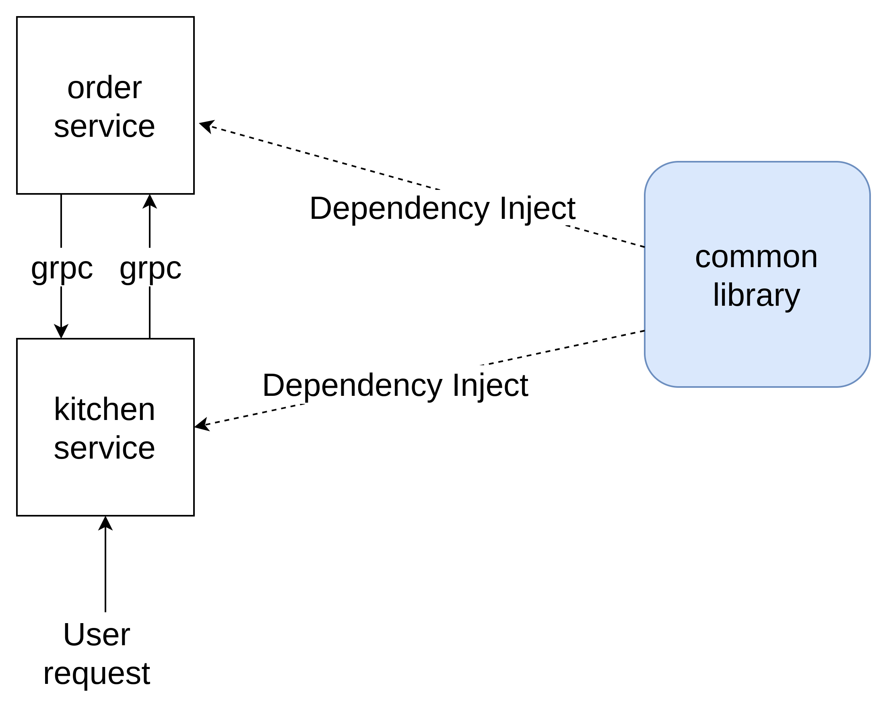

# golang with grpc protocol sample

This project is demo for use grpc protocol as communication between inner services

## architecture diagram



## define protobuf for service interface

```protobuf
syntax = "proto3";

option go_package = "github.com/leetcode-golang-classroom/golang-order-management-system/orders";

service OrderService {
  rpc CreateOrder(CreateOrderRequest) returns (CreateOrderResponse) {}
  rpc GetOrders(GetOrdersRequest) returns (GetOrderResponse) {}
}

message Order {
  int32 OrderID = 1;
  int32 CustomerID = 2;
  int32 ProductID = 3;
  int32 Quantity = 4;
}
message CreateOrderRequest {
  int32 customerID = 1;
  int32 productID = 2;
  int32 quantity = 3;
}

message CreateOrderResponse {
  string status = 1;
}


message GetOrdersRequest {
  int32 customerID = 1;
}

message GetOrderResponse  {
  repeated Order orders = 1;
}
```

## use protobuf tool to generate client code 

```shell
go install google.golang.org/protobuf/cmd/protoc-gen-go@v1.28
go install google.golang.org/grpc/cmd/protoc-gen-go-grpc@v1.2
```

## write build script for generete rpc client code

```makefile
.PHONY=build

genproto:
	@protoc \
		--proto_path=protobuf "protobuf/orders.proto" \
		--go_out=services/common/genproto/orders --go_opt=paths=source_relative \
		--go-grpc_out=services/common/genproto/orders --go-grpc_opt=paths=source_relative
```

## prebuild with source code

```makefile
build-orders:
	@go build -o bin/orders services/orders/main.go services/orders/grpc.go services/orders/http.go 
build-kitchen:
	@go build -o bin/kitchen services/kitchen/main.go services/kitchen/http.go


run-orders: build-orders
	@./bin/orders

run-kitchen: build-kitchen
	@./bin/kitchen
```

## how to run

1. start order service

```shell
make run-orders
```

2. start kitchen service
```shell
make run-kitchen
```